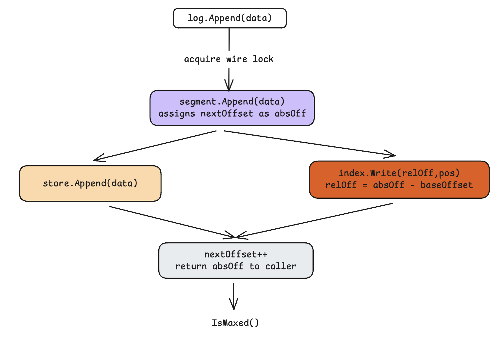
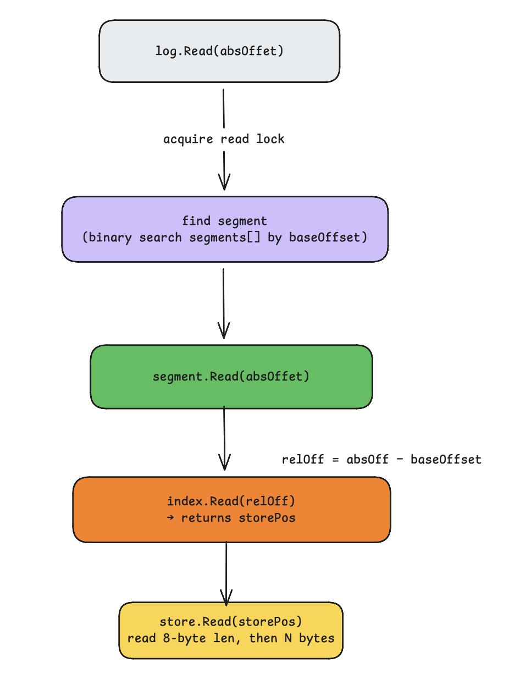
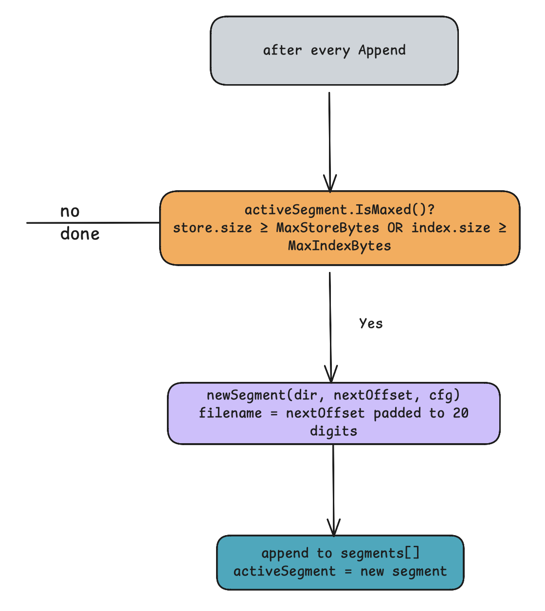
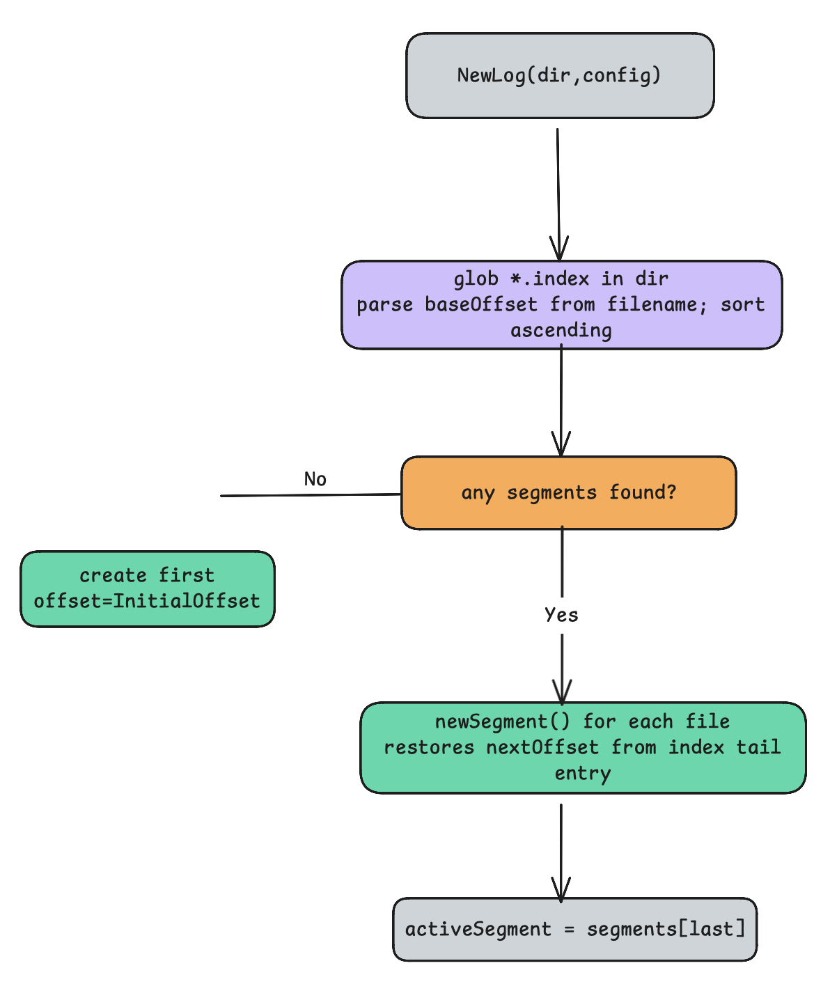

# Kafka Fundamental

## Workflow

### 1. Writh path

- How `log.Append` flows down through segment -> store + index in parallel.

### 2. Read path

- How `log.Read` binary-searches segments, then index -> store.

### 3. Segment roll

- The `IsMaxed()` check and how a new segment is created after very append.

### 4. Start up

- How `NewLog` rebuilds state from disk on restart.

